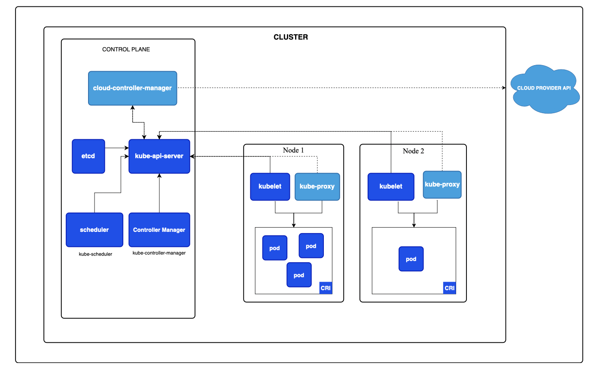

# Kubernetes

## Intro.

Kubernetes (k8s) 是一套用於管理容器(Container)的架構，由各個元件組合成管理架構。

### Architecture Concepts

### Control plane

k8s 的控制中心，負責管理(kube-apiserver)、調度(scheduler)、監控(tube-controller-manager)、紀錄(etcd) 整個集群的狀態

- kube-apiserver
    - k8s 對外開放的管理服務，由API 進行呼叫，
    在命令模式使用kubectl (kubernetes command line tool)，就是呼叫此API服務
    - Control plane 各個服務之間的通訊中心
- etcd (etc distributed)
    - 分散式的 Key value 儲存資料服務，用於儲存集群狀態與配置資料
    - 也可用於備份集群資料和災難恢復
    - 通過共識演算法(Raft) 達到維護集群一致性
- kube-scheduler
    - 負責排程服務到適當的工作節點中，
- kube-controller-manager
    - 執行多控制器的服務，用以維持集群狀態，包含但不限於以下
    - node controller
        - 監控節點狀態，何時需要移除
    - job controller
        - 檢視要處理的任務，建立 Pods 以完成任務
    - endpointSlice controller
        - 提供Pod 和Service 之間的連線
    - serviceAccount controller
        - 為自動新增的命名空間(namespaces) 建立預設服務帳號

### Node Components

- kubelet
    - 在集群中的節點負責實際部署 Pods，並且與kube-apiserver連線
- kube-proxy
    - 在集群內部將各個節點對內部與外部的網路通訊服務保持連線
- container runtime (CRI)
    - 容器化的執行環境，可選擇不同的軟體，Docker、Containerd等
- pod
    - 整個集群中最小的單位(不包含內部的 Container)，用以承載容器服務

### Addons

- DNS
- Web UI
- Container resource monitoring
- Cluster-level logging
- Network plugins

---

## Deployment Concepts

### Control plane deployment

- Traditional deployment
- Static Pods
- Self-hosted
- Managed Kubernetes services

### Workload placement considerations

### Cluster managements tools