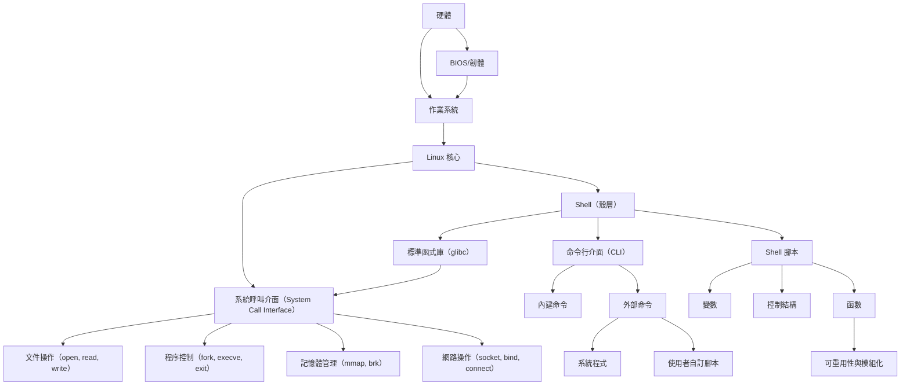

# 基本概念

## 計算機概念


## Linux 介紹

- 相容分時系統(Compatible Time-Sharing System, CTSS)
- 所有的程式或系統裝置都是檔案
- Linux 是由核心(Kernel) + 各項軟體 + ( Tools + 可完整安裝程序 )(Distribution)

## 常見單字

| `user` | 使用者 | individual account |
| --- | --- | --- |
| `group` | 群組 | collection of users |
| `owner` | 檔案/目錄擁有者 | file or directory owner |
| `permissions` | 權限 | access control for files |
| `ACL` | 存取控制列表 | Access Control List |
| `root` | 系統管理員帳戶 | superuser account |

## 常用指令

| 指令/單字 | 原始單字 | 常用參數 | 中文解釋 |
| --- | --- | --- | --- |
| `ls` | list | `-l` (詳細資訊), `-a` (顯示隱藏檔案) | 列出目錄內容 |
| `cd` | change directory | 無 | 切換目錄 |
| `pwd` | print working directory | 無 | 顯示當前工作目錄 |
| `mkdir` | make directory | `-p` (遞迴建立多層目錄) | 建立新目錄 |
| `rm` | remove | `-r` (遞迴刪除), `-f` (強制刪除) | 刪除檔案或目錄 |
| `cp` | copy | `-r` (遞迴複製), `-p` (保留檔案屬性) | 複製檔案或目錄 |
| `mv` | move | 無 | 移動或重新命名檔案 |
| `touch` | touch | 無 | 建立空檔案 |
| `cat` | concatenate | `-n` (顯示行號) | 顯示檔案內容 |
| `echo` | echo | 無 | 輸出文字到檔案 |
| `chmod` | change mode | `+x` (增加執行權限), `u+r` (使用者加讀取權限) | 修改檔案權限 |
| `chown` | change owner | `user:group` (指定使用者與群組) | 修改檔案擁有者 |
| `chgrp` | change group | 無 | 修改文件或目錄的群組 |
| `grep` | global regular expression print | `-i` (忽略大小寫), `-r` (遞迴搜尋) | 搜尋檔案中的文字 |
| `find` | find | `-name` (依名稱搜尋), `-type` (依類型搜尋) | 搜尋檔案或目錄 |
| `tar` | tape archive | `-cvf` (建立壓縮檔), `-xvf` (解壓縮) | 壓縮或解壓縮檔案 |
| `zip/unzip` | zip/unzip | `-r` (遞迴壓縮) | 壓縮或解壓縮檔案 |
| `df` | disk free | `-h` (以人類可讀方式顯示) | 檢查磁碟空間 |
| `du` | disk usage | `-h` (以人類可讀方式顯示), `-s` (總計大小) | 檢查檔案或目錄大小 |
| `ps` | process status | `-aux` (顯示所有進程) | 顯示執行中的程序 |
| `kill` | kill | `-9` (強制終止) | 終止程序 |
| `top` | table of processes | 無 | 實時顯示系統資源使用情況 |
| `man` | manual | 無 | 查看指令手冊 |
| `sudo` | superuser do | 無 | 以管理員權限執行指令 |

## Linux 權限概念

### 資料夾權限概念

```bash
drwxr-xr--  2 user group 4096 Dec 15 10:00 my_folder
```

第一個字元代表這個檔案是『目錄、檔案或連結檔等等』：

- 當為[ **d** ]則是目錄，例如[上表](https://linux.vbird.org/linux_basic/centos7/0210filepermission.php#table2.1.1)檔名為『.config』的那一行；
- 當為[ **-** ]則是檔案，例如[上表](https://linux.vbird.org/linux_basic/centos7/0210filepermission.php#table2.1.1)檔名為『initial-setup-ks.cfg』那一行；
- 若是[ **l** ]則表示為連結檔(link file)；
- 若是[ **b** ]則表示為裝置檔裡面的可供儲存的周邊設備(可隨機存取裝置)；
- 若是[ **c** ]則表示為裝置檔裡面的序列埠設備，例如鍵盤、滑鼠(一次性讀取裝置)。

每個檔案或目錄的權限由三組 rwx 來定義：

1. **擁有者 (Owner)**：檔案的擁有者。
2. **群組 (Group)**：擁有權限的使用者群組。
3. **其他人 (Others)**：系統中所有其他使用者。

檔案和目錄擁有三種基本權限：讀取 (r)、寫入 (w) 和執行 (x)。

- **讀取 (r)**：允許查看資料夾內容或檔案內容。
- **寫入 (w)**：允許修改檔案或新增、刪除資料夾中的檔案。
- **執行 (x)**：允許執行檔案或進入資料夾。
- 權限格式以 `rwx` 表示，用數值表示（對應為二進制）：`r=4, w=2, x=1`，例如：`rwx` 對應數值 `7`。

### 2. 使用者權限

檔案和目錄的三種權限：

- **使用者 (User)**：檔案的擁有者。
- **群組 (Group)**：屬於特定群組的成員。
- **其他人 (Others)**：所有其他使用者。

可以使用 `chmod` 指令修改權限，例：

```bash
chmod u+rwx,g+rx,o+x file_name
```

或者使用數字模式：

```bash
chmod 755 file_name
```

### 3. ACL (存取控制列表)

ACL 允許管理員設定單個使用者或群組對檔案或目錄的存取權限。例如，可以為特定使用者新增讀取、寫入、執行權限，而不影響其他群組或使用者。

- **查看 ACL**：

```bash
getfacl file_name
```

- **設定 ACL**：

```bash
setfacl -m u:username:rwx file_name
```

- **刪除 ACL**：

```bash
setfacl -x u:username file_name
```

## 使用者與群組管理

### **UID（User ID）**

1. **定義**：
    - UID 是每個使用者在系統中的唯一標識符。
    - 每個使用者在系統中都有一個唯一的 UID，與其賬戶名相關聯。
2. **範圍**：
    - 通常 UID 是一個整數，範圍如下：
        - **0**：系統中的超級使用者 (root)。
        - **1–999**：保留給系統進程或服務使用（取決於發行版，可能為 1–99 或 100–999）。
        - **1000 及以上**：普通使用者。

### **使用者管理**

| 指令 | 功能 | 參數說明 |
| --- | --- | --- |
| `useradd <username>` | 新增使用者 |  |
| `usermod -aG <groupname> <username>` | 將使用者加到群組 | `-a` 新增、追加 `-G` 群組  |
| `passwd <username>` | 設定或修改使用者密碼 |  |
| `userdel <username>` | 刪除使用者 |  |
| `id <username>` | 查看使用者所屬群組及UID、GID |  |

---

### **GID（Group ID）**

1. **定義**：
    - GID 是群組的唯一標識符。
    - 每個群組在系統中都有一個 GID，用於管理和區分群組的權限。
2. **主要群組與輔助群組**：
    - 每個使用者都有一個**主要群組**（Primary Group），它的 GID 與使用者相關聯。
    - 使用者也可以屬於多個**輔助群組**（Supplementary Groups）。

### **群組管理**

| 指令 | 功能 |
| --- | --- |
| `groupadd <groupname>` | 新增群組 |
| `groupmod -n <newname> <groupname>` | 修改群組名稱 |
| `groupdel <groupname>` | 刪除群組 |
| `gpasswd -a <username> <groupname>` | 加使用者到群組 |
| `gpasswd -d <username> <groupname>` | 從群組移除使用者 |

## Bash概念



- 可以使用 `type` 取得現在的指令是否屬於內建指令
- 若指令太長，可以使用反斜線 `\` 截斷指令再接續

### Bash 變數

| 動作 | 指令 | 註解 |
| --- | --- | --- |
| 讀取變數 | `echo ${VAR}` | echo “string” >> file |
| 設定變數 | `varname="John"` | 直接賦值 |
| 唯讀變數 | `readonly PATH_CONFIG="/etc/path"` | 宣告後無法修改 |
| 陣列變數 | `fruits=("apple" "banana" "orange")` | 儲存多個值 |
| 數值運算 | `result=$((5 + 3))` | 進行數學計算 |
| 字串連接變數 | `"This is $varname"` | 變數可以通過＄讀進 |
| 指令變數 | `version=$(uname -r)` | 變數可以儲存指令 |
| 取消變數 | `unset varname` |  |

| 動作 | 指令 | 說明 |
| --- | --- | --- |
| 列出環境變數 | `env` 、 `export` |  |
| 列出環境變數與自訂變數 | `set` |  |
| 輸出變數到環境變數 | `export varname` |  |

| 動作 | 指令 | 說明 |
| --- | --- | --- |
| 讀取輸入 | `read varname`  | 讀取輸入後存入變數 |
| 設定變數型態 | `declare [-aixr] variable`  |  |

```
選項與參數：
-a  ：將後面名為 variable 的變數定義成為陣列 (array) 類型
-i  ：將後面名為 variable 的變數定義成為整數數字 (integer) 類型
-x  ：用法與 export 一樣，就是將後面的 variable 變成環境變數；
-r  ：將變數設定成為 readonly 類型，該變數不可被更改內容，也不能 unset
```

陣列

`var[0]="test"`

`var[1]="test"`

`var[2]="test"`

刪除變數部分內容

**`echo ${variable#/*local/bin:}`**

| 指令 | 說明 |
| --- | --- |
| echo | 讀取變數 |
| ${ } | 特殊注記 |
| variable | 變數名稱 |
| # | 從前面由右往左刪除 |
| /*local/bin | 關鍵字 |

| ${變數#關鍵字}
${變數##關鍵字} | 若變數內容從頭開始的資料符合『關鍵字』，則將符合的最短資料刪除若變數內容從頭開始的資料符合『關鍵字』，則將符合的最長資料刪除 |
| --- | --- |
| ${變數%關鍵字}
${變數%%關鍵字} | 若變數內容從尾向前的資料符合『關鍵字』，則將符合的最短資料刪除若變數內容從尾向前的資料符合『關鍵字』，
則將符合的最長資料刪除 |
| ${變數/舊字串/新字串}${變數//舊字串/新字串} | 若變數內容符合『舊字串』則『第一個舊字串會被新字串取代』若變數內容符合『舊字串』則『全部的舊字串會被新字串取代』 |

替換變數

| 變數設定方式 | str 沒有設定 | str 為空字串 | str 已設定非為空字串 |
| --- | --- | --- | --- |
| var=${str-expr} | var=expr | var= | var=$str |
| var=${str:-expr} | var=expr | var=expr | var=$str |
| var=${str+expr} | var= | var=expr | var=expr |
| var=${str:+expr} | var= | var= | var=expr |
| var=${str=expr} | str=exprvar=expr | str 不變var= | str 不變var=$str |
| var=${str:=expr} | str=exprvar=expr | str=exprvar=expr | str 不變var=$str |
| var=${str?expr} | expr 輸出至 stderr | var= | var=$str |
| var=${str:?expr} | expr 輸出至 stderr | expr 輸出至 stderr | var=$str |

### 別名

| 指令 | 說明 | 使用 |
| --- | --- | --- |
| `alias` | 設定別名 | **`alias lm='ls -al | more'`** |
| `unalias` | 取消別名 | `unalias lm`  |

### 鍵盤熱鍵

| 組合按鍵 | 執行結果 |
| --- | --- |
| Ctrl + C | 終止目前的命令 |
| Ctrl + D | 輸入結束 (EOF)，例如郵件結束的時候； |
| Ctrl + M | 就是 Enter 啦！ |
| Ctrl + S | 暫停螢幕的輸出 |
| Ctrl + Q | 恢復螢幕的輸出 |
| Ctrl + U | 在提示字元下，將整列命令刪除 |
| Ctrl + Z | 『暫停』目前的命令 |

### 特殊符號

| 符號 | 意義 |
| --- | --- |
| * | 代表『0個到無窮多個』任意字元 |
| ? | 代表『一定有一個』任意字元 |
| [ ] | 代表『一定有一個在括號內』的字元(非任意字元) |
| [ - ] | 在中括號內時，代表『在編碼順序內的所有字元』 |
| [^ ] | 中括號內第一個字元為指數符號時，表示『反向選擇』 |
| # | 註解符號，用於script說明，後續資料均不執行 |
| \ | 跳脫符號：將特殊字元或萬用字元還原成一般字元 |
| | | 管線 (pipe)：分隔兩個管線命令的界定 |
| ; | 連續指令下達分隔符號 |
| ~ | 使用者的家目錄 |
| $ | 取用變數前置字元 |
| & | 工作控制：將指令變成背景下工作 |
| ! | 邏輯運算中的『非』(not) |
| / | 目錄符號：路徑分隔的符號 |
| >, >> | 資料流重導向：輸出導向，分別是『取代』與『累加』 |
| <, << | 資料流重導向：輸入導向 |
| ' ' | 單引號，不具有變數置換的功能 |
| " " | 雙引號，具有變數置換的功能 |
|  | 兩個『`』中間為可以先執行的指令，亦可使用 $() |
| ( ) | 中間為子shell的起始與結束 |
| { } | 中間為命令區塊的組合 |

1. 標準輸入　(stdin) ：代碼為 0 ，使用 < 或 << ；
2. 標準輸出　(stdout)：代碼為 1 ，使用 > 或 >> ；
3. 標準錯誤輸出(stderr)：代碼為 2 ，使用 2> 或 2>> ；

**cmd ; cmd (不考慮指令相關性的連續指令下達)**

**$? (指令回傳值) 與 && 或 ||**

**管線命令 (pipe)**

**擷取命令： cut, grep**

**排序命令： sort, wc, uniq**

**雙向重導向： tee**

**字元轉換命令： tr, col, join, paste, expand**

## Shell Script

利用Shell 功能轉寫成一支程式，就是Shell script

Shell Script 可以如下範本

```bash
#!/bin/bash

# Function to check if a file exists
check_file_exists() {
    read -p "Enter file name to check: " file
    if [ -f "$file" ]; then
        echo "File '$file' exists."
    elif [ -d "$file" ]; then
        echo "'$file' is a directory."
    else
        echo "File or directory '$file' does not exist."
    fi
}

# Function to determine if a number is positive, negative, or zero
determine_number_type() {
    read -p "Enter a number: " number
    if [ "$number" -gt 0 ]; then
        echo "The number $number is positive."
    elif [ "$number" -lt 0 ]; then
        echo "The number $number is negative."
    else
        echo "The number is zero."
    fi
}

# Function to compare two numbers
compare_numbers() {
    read -p "Enter first number: " num1
    read -p "Enter second number: " num2
    if [ "$num1" -eq "$num2" ]; then
        echo "The numbers are equal."
    elif [ "$num1" -gt "$num2" ]; then
        echo "$num1 is greater than $num2."
    else
        echo "$num1 is less than $num2."
    fi
}

# Main menu
while true; do
    echo "\nSelect an option:"
    echo "1. Check if file or directory exists"
    echo "2. Determine if a number is positive, negative, or zero"
    echo "3. Compare two numbers"
    echo "4. List directory contents"
    echo "0. Exit"

    read -p "Enter your choice: " choice

    case $choice in
        1) check_file_exists ;;
        2) determine_number_type ;;
        3) compare_numbers ;;
        4) list_directory ;;
        0) echo "Exiting..."; break ;;
        *) echo "Invalid choice, please try again" ;;
    esac

done

```

## 網路概念